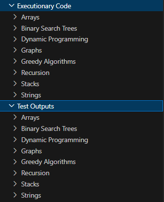

# AlgoExpert

In the summer of 2022 I refined my algorithmic and data structure skills by studying the theoretical concepts and applying them to practical problems. Most of these problems are solved in *Python*, and a few in *C#* and *Javascript*. About a year later I attended a course covering the same topic and extended this skill further. To see more of my experience in this domain, navigate to [Data Structures & Algorithms](https://gitlab.com/jex-projects/mrjex/-/tree/main/projects/1.%20courses/year-1/5.%20Data%20Structures%20&%20Algorithms)

## Automation & Test Cases

About two years after I solved the problems, in 2024, I set out to automate a testing system process to practice my *Bash* proficiencies. In essence, `run.sh` checks the folder structure contained in `Executionary Code` and locates the relevant files *(.py, .js, .cs, ...)* and store their output in *.txt* files in a simulated folder-structure format in `Test Outputs`:

**run.sh:**
 - Runs all scripts in `/Executionary Code`, where all of my coded algorithms are located
 - Generates text files for each datastructure and appends the results to them, making it easy to compare the expected vs actual value
 - Creates the folder structure during runtime, meaning that the developer doesn't have to spend time syncing the test folders in `/Test Outputs` with the ones in `/Executionary Code`

This is the synced folder structure after the script is executed:

